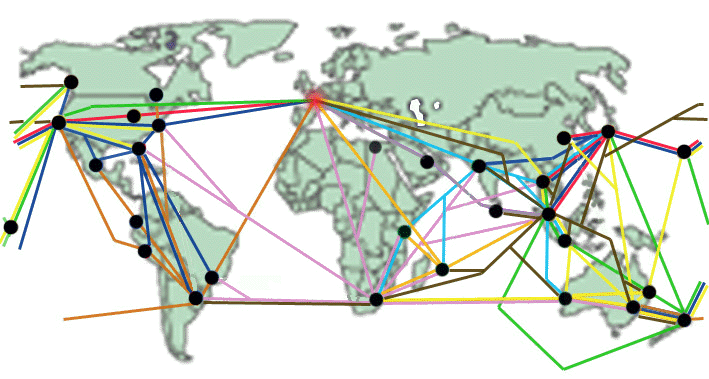

*Couloirs extrêmes lointains engagés perdus de la mort qui tue sans secours qu’on va tous mourir au fin fond de la Patagonie et se faire dépecer par des pingouins*

Thème de l’expé : bon en gros ce qui est écrit ds le titre. Après grosse réunion à la Réunion, le thème des beaux couloirs (ou belles pentes) un peu raidos et un peu paumés est ressorti. Les 2 critères sont remplis, à savoir qu’a priori c’est vendeur et que certainement on perdra Manu.

# Pays 
Italie/Autriche ; Norvège ; Russie, Oural, Sibérie ; Caucase ; Moyen Orient ; Japon ; Corée ; Nouvelle Zélande ; Cashemire/Inde ; Argentine ; Chili ; Bolivie ; Pérou ; US ; Canada ; Alaska ; Groenland/Baffin

# Qui s'occupe de où ? 
  * Responsable Amérique du Nord : Thieum
  * Responsable Océanie : Manu
  * Responsable Am. Du Sud : JB
  * Resp. Caucase : Ryl
  * Resp. Asie : Cone
  * Resp. Grand nord : Ptit

## Nom du projet
Y en faut un, lié avec le nom du site

=> Brainstorming ce we à la plagne

## Billets avions

###  Principales routes 
un logiciel pour planifier son TDM sur one world [http://www.riders-around-the-world.com/info/info.php?id=17] A essayer
###  Principales routes 

 Il faut voir que c est pas cher si on prend ces chemins, si on en sort ca raque.

###  Site d info 
aventure du bout du monde [http://www.abm.fr/avion/gvatdm.html] : Cette page donne beacoup d infos sur les billets TDM. En résumé:

Trois démarches existent pour choisir un billet tour du monde.
- La plus simple qui consiste à prendre ce que l'on trouve parmi l'offre des voyagistes.
- Opter pour la formule pass des groupes de compagnies tel Star Alliance et autres. Ne pas hésiter à prendre le billet depuis Londres, souvent moins cher.
- Monter soi-même son circuit avant de le proposer ensuite à une agence.

Exemples
' de 900 à 1 400 € : mini tours d'Asie comprenant généralement 3 ou 4 stops
' de 1 400 à 1 700 € :axés sur l'Asie (principales villes) avec aussi plus de facilités d'incursions aux USA (Ouest et Est) et Hawaii ou même l'Australie/Nouvelle Zélande. (jusqu'à 6 ou 7 stops ).
' de 1 700 à 2 000 € :Encore l'Asie  avec aussi très facilement l'Amérique du Nord  l'Australie  la Nouvelle-Zélande ou (Hawaii, Tahiti...)
' de 2 000
à 2 500 € : Beaucoup de possibilités. On peut obtenir de 7 à 10 stops  sur Asie/ Pacifique/ Amérique du Nord (ou/et ponctuellement Sud) ou Afrique de l'Est/ Asie/ Pacifique/ Amérique du Nord ou Sud.
' de 2 500 à 3 000 € :certaines destinations ou combinaisons sont plus facilement accessibles. Asie/ Pacifique/ Amérique du Sud (parcours terrestres entre villes) ou Afrique de l'Est/ Asie/ Pacifique/ Amérique du Nord. A ce prix on peut aussi faire toute l'Amérique du Sud et Centrale. 

[Last agence fr TDM](http://www.connaisseursvoyage.fr/). Devis gratuit, info prix pays, Ex tableau preparation
Y a des conseils pas mal.

 Conseil d'un voyageur : depuis Londres avec One World ou Star Alliances et de vous mettre directement en contact avec british airways. www.ba.com ou par l'intermédiaire d'une très bonne agence basée à Londres: www.trailfinders.com. 

### Assurance 
Resp. : Manu
 
### Info autres projets 
- [Assurance tous risques à l'année 300 Eur](http://annabelle.bailleul.free.fr/) 
- caution en cas de prison
- le capital décès
- le rapatriement
- les lunettes et le dentiste... 

# Association 
Doit en faire une loi 1901 ? Pour quoi faire ?
  * assurance, responsabilité ?
  * Crédibilité pour sponsoring ?

Faudra définir et déposer des statuts.

moi; je pense que c est pas mal (Pierre)
moi aussi (Ryl) : + crédible
