# Cyril
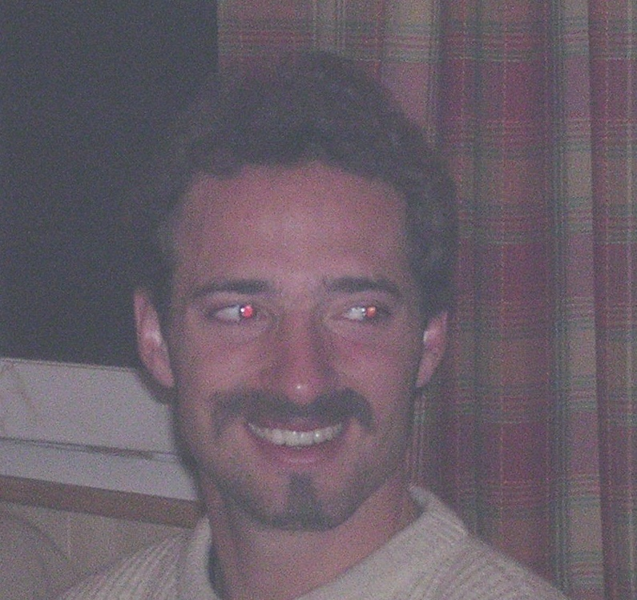 
- Groupe sanguin : O- (ca peut servir)
- don d’organes : oui, ceux qui restent
- testament: je lègue tout au(x) survivant(s)
- guns : Stoeckli Strormrider DP
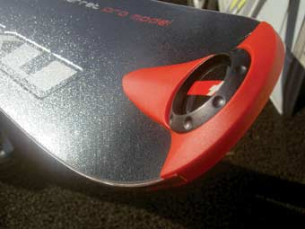
- Niveau :
  - technique : minimal, mais ca passe
  - physique : manque un peu de cuisse au lit
- psychologique : voir photo
- Signe distinctif, particulier: attrape beaucoup de puces en automne

Responsable de 

- Recherche d'infos
  - recherche documentaire (web, topos, atlas, rapports d’expés (penser au CAF), anciens magazines ski, trek, alpinisme, expé…) 
  - Responsable Caucase
  - Contacter des membres d’anciennes expés
  - Contacter des riders/montagnards pros (cf contact Jérôme des Nuits de la Glisse)

- Communication/Financement
  - Rédiger et éditer une plaquette ( rassembler infos, faire budget) 
  - Recenser les différentes boites (ou autres) à qui demander du matos ou de l’argent. Bien cibler en fonction de nos besoins et de leur image. Bien leur faire croire qu’ils sont indispensables et intégrés au projet. Bien montrer ce qu’on est capable de rapporter en échange. A mon avis, la aussi faut aller chercher bcp de boites, ms en restant pertinents. Je pense qu’on sous estime la capacité des boites à sponsoriser ce genre de projets. Voir si une boite ne voudrait pas nous parrainer.
  - Recenser nos points d’entrée par contacts ds les boites pr maximiser nos chances à tous

- Logistique
  - Définir le matos nécessaire. Et mettre ça en rapport avec les sponsors dont nous avons besoin.
  - Voir où et comment on pourra faire de l’hélico
  - Etablir un petit planning pour organiser au mieux les RDV sur place avec nos invités (potes, famille, copines…)

- Administratif
  - Assedic : chomage si on refuse un CDI ?
  - Assedic : précisions sur suspension des droits

# Emmanuel
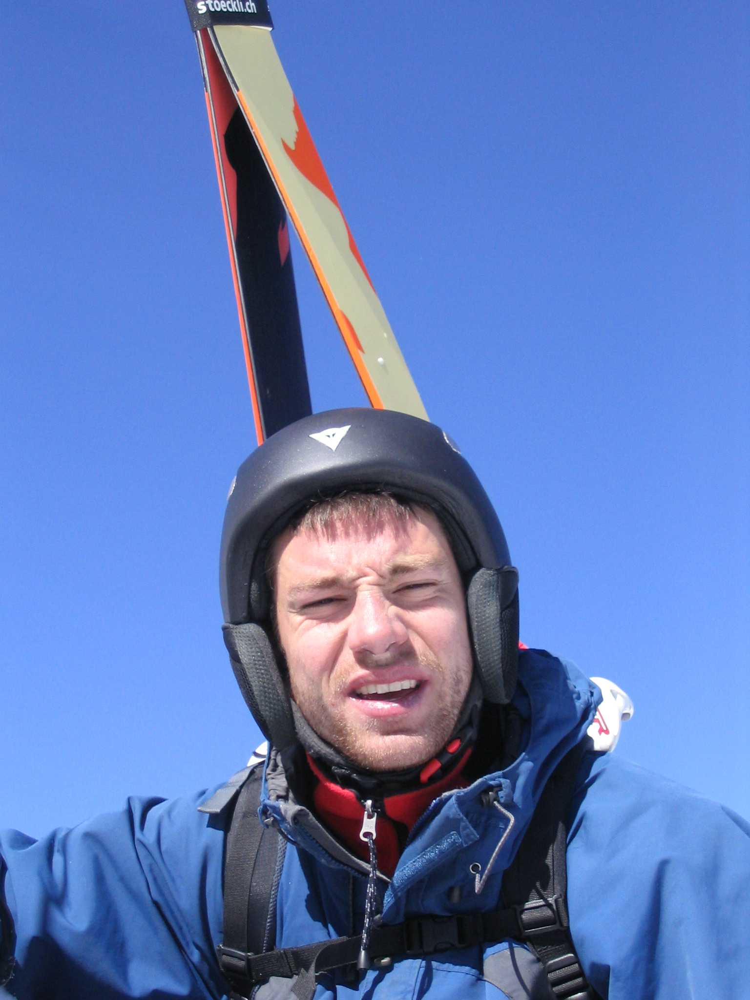 et en accès libre sur le web :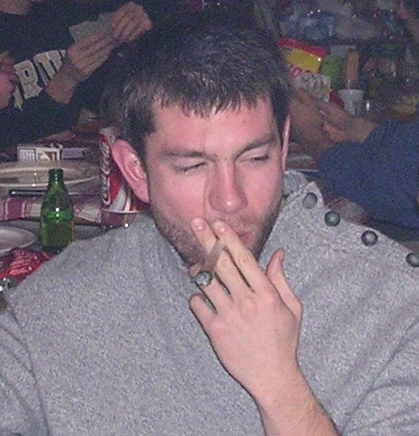

- Comment me joindre:
    - Tel: 06 92 11 50 88
    - Email: emmanuel@nautin.com
    - Courrier: 40 rue des Espadons 97434 Saint Gilles Les Bains LA REUNION
    - Adresse parentale: 185 bis avenue du général Leclerc 78220 tel : 06 70 07 11 15
- Métier: masseur-kinésithérapeute
    syndiqué au FFMKR (syndicat de la profession)
- Spécialité: le ride en toute situation, je dis bien dans toutes!!! Et Skieur bien sûr
- Adhérent à la FFME et à l'Echo des Ravines (club de canyonning)
- Groupe sanguin: A+
- Opération: appendisectomie
- Antécédents: épisode allergique au paracétamol, asthme infantile
- Dons d'organes: OUI
  - Assurance :  
  - Niveau :
    - technique : critère inutile puisqu'il mise tout sur le physique (c'est d'ailleurs grâce à cette tactique qu'il a obtenu son surnom)
    - physique : depuis quelques temps, ca va mieux. On aura bientôt un Mitch Buchannon de la neige. Mouais, en fait, depuis le retour de la Réunion, il y a du mieux, ms c'est pas encore ça. Risque de devoir payer un supplément surpoids...
    - psychologique : critère inutile puisque pas de cerveau

  - Signe distinctif : Atteint de chikungunya, a contaminé 110 000 personnes à la Réunion
dépense énergétique de 1000 kcal par centaine de mètre de dénivelé ... à la descente !
Il se prépare physiquement et devient Le véritable MITCH!!!! Malheureusement le fessier ne prend toujours pas....tragique, non?!!! Je pleure...rien à faire, je pleure............
 

====== Responsable de ======
  * Trouver une [[Projet:assurance]] 
  * Recherche et planning de dépôts de la plaquette du projet pour l'obtention de bourses et subventions
  * Topos Océanie.
# François

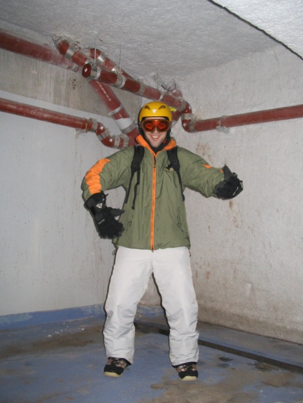

Description :
un rider totalement méconnu et qui gagne à le rester, limité car il a les 2 jambes attachées à un bout de bois, affichant un style démodé des trashouillers de Los Angeles des années 80, avec un problème nerveux à la main droite qui l'oblige à garder le pouce et l'auriculaire écartés, pas très à l'aise et boitant comme un cul de jatte sur terre ms virevoltant au dessus de la peuf : le Ciscotross !!!
# Jean-Baptiste
- Style: améliorable :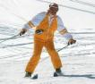
- signe particulier: aime les vrai femmes: 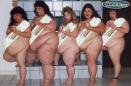
# Mathieu
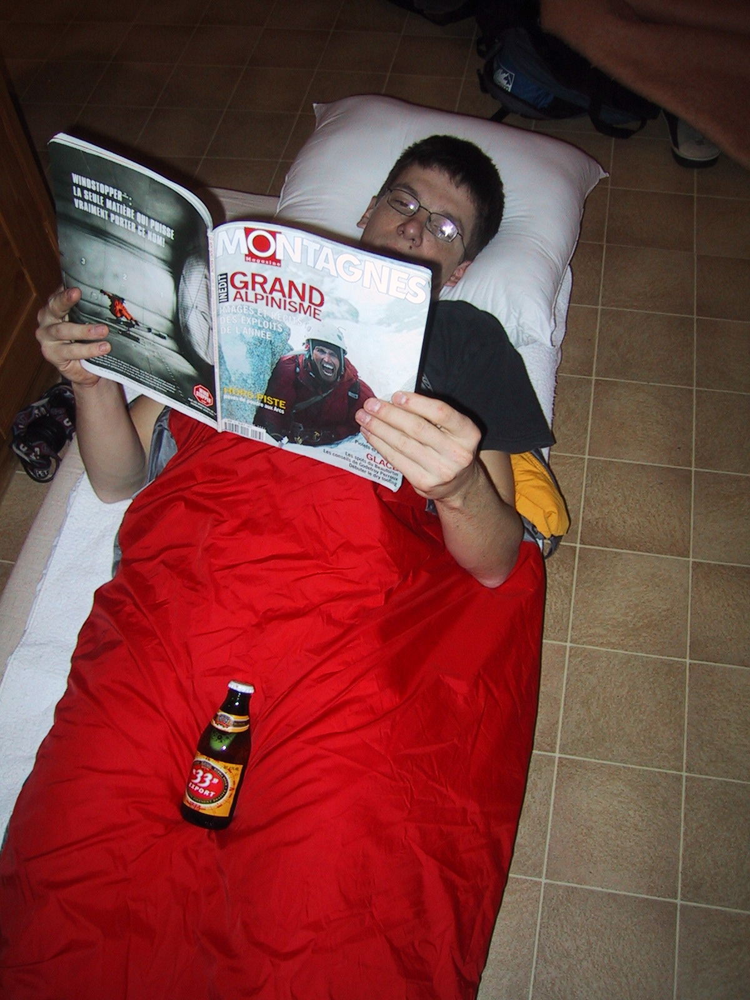
# Nicolas
**Ptitbit Planet champion 2005**=== En-tête 4 ===

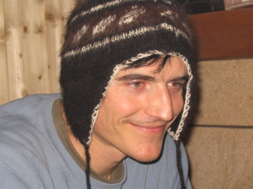

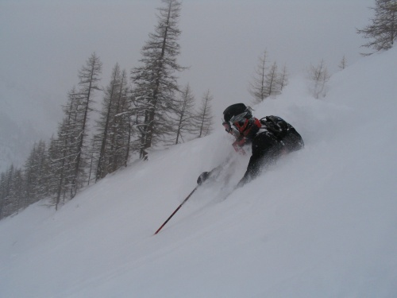

N'oublies pas mon cable !

# Pierre-Charles
- Groupe sanguin : O+ (ca peut servir)
- don d'organes : oui, ceux qui restent.
- testament: non, brulez tout.
- guns : scrutch oranges trop beaux
- Niveau :
    - technique : pas mal, quelques améliorations possibles : trop sur l'arrière, trop serré, mouvement de tapette avec les batons
    - physique : Aie ! C'est la que la bât blesse... De gros efforts la dessus
    - psychologique : renonce trop facilement. Stage du GIGN à prévoir

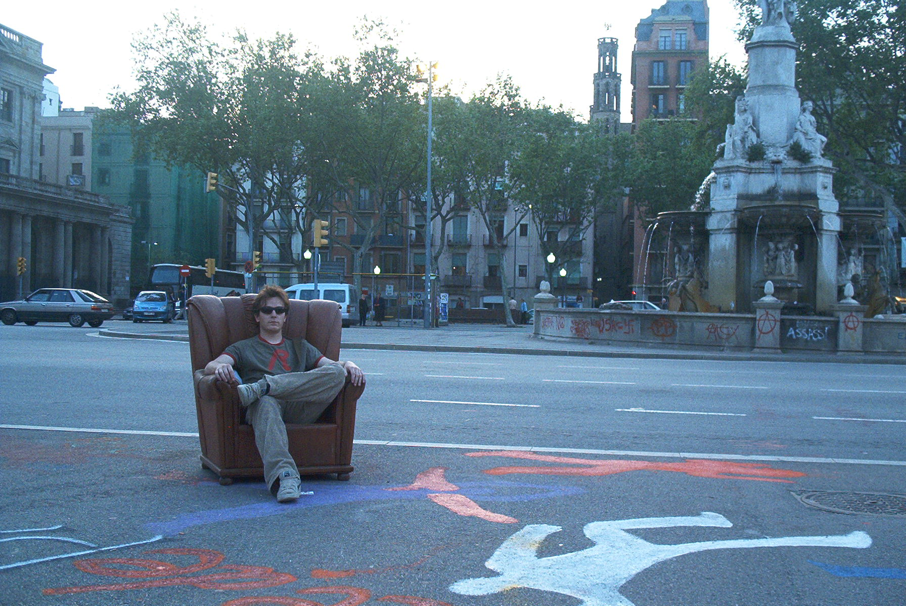 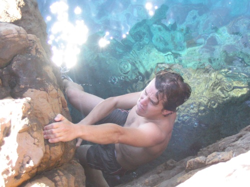 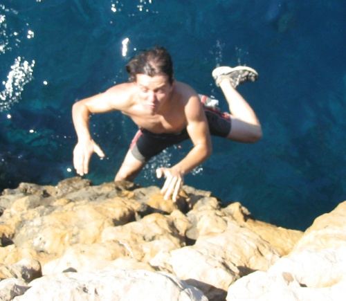

Responsable de
- site web
- billets avion
- Grand nord
