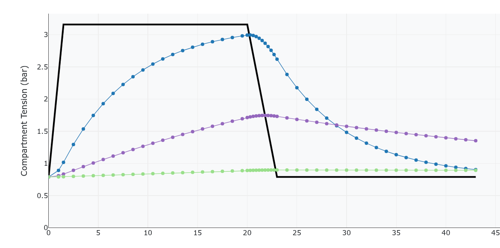
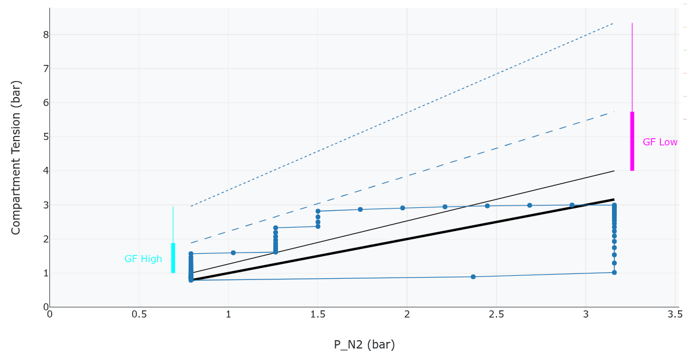

Publié en 2025. [English version](./algorithm_en.md)

Ce document décrit l'algorithme de décompression implémenté dans cet [outil](./index.html), qui est basé sur le **modèle Bühlmann ZHL-16C** avec Facteurs de Gradient (GF). L'algorithme simule l'absorption et la libération de gaz inerte (Azote) dans 16 compartiments tissulaires théoriques pendant une plongée et calcule un profil de décompression sûr.

# Concepts

*   **Modèle Bühlmann ZHL-16C**: Ce modèle utilise 16 compartiments tissulaires (types de tissus), chacun caractérisé par une demi-vie (t12), et des coefficients 'A' et 'B'. Ces paramètres définissent la vitesse à laquelle un compartiment absorbe et libère le gaz inerte, ainsi que sa tension maximale admissible de gaz inerte (valeur M) à une pression ambiante donnée.
*   **Pression Partielle d'Azote (PN2)**: La quantité d'azote dans le gaz respiré (air, 79% N2) à une profondeur donnée.
*   **Tension Tissulaire**: La pression partielle d'azote au sein d'un compartiment tissulaire.
*   **Valeurs M**: La tension maximale admissible de gaz inerte dans un compartiment tissulaire à une pression ambiante donnée.
*   **Facteurs de Gradient (GF)**: Un facteur de sécurité appliqué aux valeurs M. `GF_low` est appliqué à la profondeur maximale, et `GF_high` à la surface. Nous pouvons interpoler linéairement le GF entre ces deux valeurs en fonction de la profondeur actuelle.
*   **Valeurs M Modifiées**: Les valeurs M ajustées par les Facteurs de Gradient, créant ainsi un "couloir" dans lequel la tension tissulaire doit rester.

# 2. Calcul du Profil de Plongée

## a. Initialisation

Les 16 compartiments commencent avec des tensions égales à la PN2 de surface (0,79 bar). `bottomTime`, `maxDepth`, `GF_low` et `GF_high` sont pris en entrée.

## b. Phase de Descente

*   Le plongeur descend de la surface à `maxDepth` à une `DESCENT_RATE` constante.
*   Pendant la descente, les tensions des compartiments sont continuellement mises à jour chaque minute (`TIME_STEP`).

## c. Phase de Fond

*   Après avoir atteint `maxDepth`, le plongeur reste à cette profondeur pendant le `bottomTime` (moins le temps de descente).
*   Les tensions des compartiments continuent de se charger (augmenter) en fonction de la PN2 à `maxDepth`.

  

Sur ce graphique, nous voyons les tensions de 3 compartiments (le plus rapide, le plus lent et un intermédiaire) augmenter pendant la descente et le temps de fond, puis diminuer après la remontée à la surface.

## d. Phase de Remontée et de Paliers

C'est la partie la plus critique de l'algorithme, où les paliers de décompression sont déterminés. Le plongeur remonte itérativement de `maxDepth` vers la surface (`LAST_STOP_DEPTH`, typiquement 3m).

1.  **Déterminer la Prochaine Profondeur Cible**: L'algorithme calcule la prochaine profondeur de palier potentielle, typiquement par incréments de `STOP_INTERVAL` (par exemple, 3m).
2.  **Simuler la Remontée à la Prochaine Profondeur**: Il simule d'abord une remontée à cette `nextDepth` à la `ASCENT_RATE` et calcule les tensions résultantes (`tensions_next`).
3.  **Vérifier la Sécurité**: `isSafeAtDepth` est appelée pour vérifier si tous les compartiments seraient dans leurs `valeurs M modifiées` à cette `nextDepth`.
    *   Le `GF` utilisé pour la valeur M modifiée est interpolé en fonction de la `currentDepth` et de la `maxDepth`.
    *   Si la tension d'un compartiment dépasse sa valeur M modifiée, il est considéré comme dangereux de remonter directement.
4.  **Palier de Décompression (si dangereux)**:
    *   Si dangereux, un palier est initié à la `currentDepth`.
    *   Le plongeur reste à `currentDepth`, et les tensions sont mises à jour par incréments de `TIME_STEP`.
    *   L'algorithme vérifie continuellement s'il est sûr de remonter à `nextDepth` après chaque `TIME_STEP`.
    *   Une fois que c'est sûr, le palier se termine, et les détails du palier sont ajoutés au tableau `stops`.
5.  **Effectuer la Remontée**: Le plongeur remonte ensuite à la `nextDepth`.
6.  **Répéter**: Les étapes 1 à 5 sont répétées jusqu'à ce que `currentDepth` soit inférieure ou égale à `LAST_STOP_DEPTH`.

## e. Remontée Finale à la Surface

*   Une fois que le plongeur atteint `LAST_STOP_DEPTH`, une remontée finale à la surface (0m) est effectuée sans palier.
*   Les tensions sont mises à jour, et `t_dive_total` et `dtr` sont incrémentés.

## f. Attente en Surface

*   Après avoir atteint la surface, la simulation continue pendant `SURFACE_WAIT_MIN` (par exemple, 20 minutes).

## g. Visualisation

  

Nous pouvons visualiser le plan de plongée dans l'espace `(p_N2, tension)`. La plongée commence en bas à gauche, se déplace vers le bas à droite pendant la descente. Pendant le temps de fond, la tension
