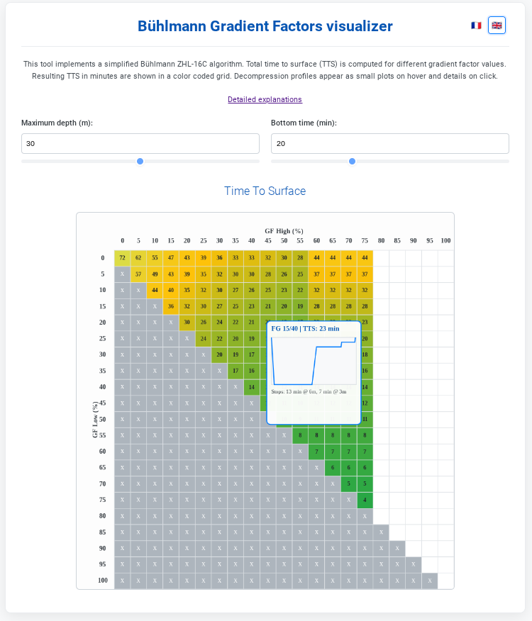

---
title: Visualiseur des facteurs de gradient 
--- 

Publié en 2025. [English version](./README.md)sdsd dfsfd

[Cet outil](./index.html) est une page web simple montrant comment les **facteurs de gradient** (FG) impactent le plan de décompression des plongées sous-marines. Il est possible de choisir des FG sur la plupart des ordinateurs récents, mais il n'existe pas de directives solides des fabricants sur la façon de le faire. Et les valeurs par défaut peuvent ne pas être adaptées à toutes les situations. L'objectif de cet outil est de construire une intuition sur l'effet des FG.

  

Cet outil implémente un algorithme simplifié [Bühlmann ZHL-16C](https://en.wikipedia.org/wiki/B%C3%BChlmann_decompression_algorithm) en Javascript.
La durée totale de remontée (DTR) est calculée pour de nombreuses valeurs des facteurs de gradient. Les DTR résultants sont rapportés sous forme de tableau. Les plans de décompression sont affichés sous forme de petits graphiques au survol de la souris, et les détails sont fournis en cliquant.

Pour simplifier nous supposons :
- une seule plongée
- sur un seul gaz : air
- un profil de plongée "rectangulaire" défini par `max_depth` et `bottom_time`
- un taux de descente constant de 20 m/min
- un taux de remontée constant de [10 m/min](https://www.cmas.org/fact-sheets/correct-ascent-rate.html)
- toutes les unités sont dans le système métrique (bar, mètres, minutes)

## Définition

Les facteurs de gradient déterminent la sursaturation maximale autorisée dans les compartiments tissulaires durant une remontée de plongée. La sursaturation survient lorsqu'une pression partielle de gaz dans le corps (sa "tension") est supérieure à la pression ambiante. Typiquement le gaz est l'azote pour les plongées à l'air. Une petite quantité de sursaturation est normale et attendue pendant la remontée. Mais lorsqu'elle devient trop importante, des bulles peuvent se former et/ou un accident de décompression (ADD) peut se produire. Un plongeur peut utiliser les FG pour ajouter une marge de sécurité sur la limite de sursaturation donnée par la base ZHL-16C.

Plus précisément, les facteurs de gradient sont 2 paramètres `(GF_low, GF_high)` à définir entre 0% et 100%.
Ils ont été introduits par Erik Baker dans [Understanding M-values, 1999](./media/1999_Baker_understanding_Mvalues.pdf).

Terminologie : *Facteurs de gradient* sont nommés ainsi parce que :
- ils sont appliqués comme un *facteur* multiplicatif à la sursaturation maximale autorisée de base (M-Value) par ZHL-16C
- ils forment un *gradient* parce que la M-value est une *différence* entre la pression partielle tissulaire et la pression partielle ambiante. (C'est un peu trompeur car, techniquement, un "gradient" est défini comme un *taux* de variation, plutôt qu'une variation elle-même.)

Plus les FG sont petits, plus la plongée est « conservative ». Typiquement :
- un petit `GF_low` tend à ajouter des paliers profonds
- un petit `GF_high` tend à rendre les paliers peu profonds plus longs

Plus "conservateur" signifie typiquement plus de paliers, des paliers plus profonds et plus longs. Mais attention ce n'est pas nécessairement "plus sûr".

## Histoire

Il existe 2 grandes familles de modèles de décompression :
- les modèles de contenu en gaz, comme Bühlmann ZHL-16C et d'autres [modèles d'Haldane](https://en.wikipedia.org/wiki/Haldane%27s_decompression_model)
- les modèles de formation de bulles, comme le "Varying Permeability Model" mentionné par Pyle dans [The Importance of Deep Safety Stops: Rethinking Ascent Patterns From Decompression Dives, 1997](./media/1997_Pyle_bubbles.pdf)

Pyle en 1997 a utilisé des modèles de bulles pour recommander des **paliers plus profonds** que Bühlmann, commençant à peu près à `max_depth/2`. 

Pour "forcer" Bühlmann à générer des paliers plus profonds, Baker a introduit en 1999 les FG. Par exemple, les FG 20/80 sont rapidement devenus une "norme" populaire en plongée technique.

Mais à partir de 2008, des [études empiriques](./media/2009_deepstops_workshop.pdf) ont commencé à montrer que les paliers profonds ne réduisaient pas toujours le risque d'ADD, et parfois l'augmentaient même. Les experts ont commencé à douter de l'utilité des soi-disant "deep stops". Mais personne ne recommandait ZHL-16C brut quand meme. 

Intuitivement, des FG trop faibles ajoutent des paliers profonds pour éliminer du gaz des tissus "rapides". Mais, en même temps, les paliers profonds peuvent augmenter la quantité de gaz dans les tissus "lents".

Ainsi, plus conservateur (c.-à-d. FG plus bas) n'est pas toujours plus sûr.

## Valeurs
On trouve une grande variété de recommandations sur internet.

### Ordinateurs
- Garmin Descent G2 : **35/75 (par défaut)** ou 40/85 ou 45/95 ou personnalisé
- Shearwater : 35/75 ou 40/85 ou 45/95 ou personnalisé
- Suunto (Ocean) : 45/80 par défaut ou personnalisé.
- Apeks : 90/90 ; 35/80 ; 30/70 ou personnalisé.

### Organisations
2015 : Un [article DAN](https://dan.org/alert-diver/article/gradient-factors/) préconise l'utilisation des FG, mais ne recommande aucune valeur, donnant juste quelques exemples
>- le réglage 15/85 pourrait être choisi par quelqu'un qui croit aux paliers profonds et a une grande confiance en sa résistance aux accidents de décompression
>- le réglage 30/70 éloigne le plongeur du fond pour le premier palier, ce qui réduit l'ongazage continu pendant la remontée. Atteindre seulement 70 pour cent de la M-value pendant la remontée offre une plus grande marge de sécurité pour la décompression

2015 : Un [billet de blog DAN](https://dan.org/safety-prevention/diver-safety/divers-blog/gradient-factors-can-be-used-to-control-for-depth-time-exposure-and-alleviate-the-risk-of-decompression-sickness-in-recreational-diving/) montre des résultats empiriques que des FG plus faibles sont associés à moins d'ADD
>- Selon la tolérance au risque personnelle, le réglage des FG peut varier mais ne devrait pas être supérieur à 0.80.

2022 : [Présentation de la Marine belge](./media/2022%20Be%20navy%20%20-%20Gradient%20Factor%20OptimizationPublic.pptx.pdf) recommande des valeurs élevées et symétriques
>- Fixer GFlow = 100% pour garder le premier palier le plus peu profond possible
>- Augmenter la « sécurité » en sélectionnant un GFhigh plus faible pour augmenter les temps de palier
>- Les restrictions logicielles actuelles n'autorisent pas ces réglages optimaux, donc utiliser des réglages GF symétriques, par ex. 90/90, 80/80, etc.
>- Les plongeurs de la Marine belge ont été conseillés de s'abstenir d'utiliser les réglages par défaut du Shearwater Perdix (30/70) et ont adopté l'approche des réglages GF symétriques.

2023 : Ce [billet PADI](https://pros-blog.padi.com/evolving-thought-on-deep-decompression-stops/) passe en revue la recherche récente et conseille d'éviter les paliers profonds
>- il n'existe pas encore de consensus sur l'endroit où devrait se situer idéalement le premier palier, certaines personnalités éminentes de la plongée de décompression exprimant désormais des préférences personnelles pour des paliers plus superficiels représentés par des valeurs GF basses de 40 et 50
>- un jour nous aurons suffisamment de recherches pour affirmer avec confiance ce que cela devrait être. Nous n'en sommes pas encore là.
>- les paliers plus profonds prescrits par les modèles de bulles sont typiquement trop profonds.

2025 : [CMAS officialise](https://www.cmas.org/fact-sheets/gradient-factors-gf-and-dive-computers.html) des recommandations pour des valeurs élevées :
>- Air/nitrox : GF_low=GF_high=entre 90 et 80% (par ex. 90/90; 85/85; 80/80) selon le facteur de risque.
>- Des FG plus bas (par ex. 75/75 ou 70/70) pourraient être envisagés en cas de facteurs de risque majeurs, mais en plongée récréative cela remettrait en question l'opportun

2025 : [LIFRAS](./media/2025%20-LIFRAS%20-%20%20Manuel%20Ma%20déco.pdf) (fédération belge)
>- GFlow = GFhigh = entre 85% et 90%

[FFESSM](https://ffessm-codep57.fr/uploads/menus/221/1PLj3v7koGqTbwDOU5ClWmpRnJNtdVhxysa8KIAHiX2/media/satdeco.pdf) Aucune recommandation explicite trouvée

### Plongeurs
2014 M. Dugrenot, J. Gallien [IANTD](https://www.iantdbenelux.com/fr/home) dans [Quel Trimix pour quelle plongée : exemples et explications de protocoles.](./media/Protocoles-De_saturation.pdf)
>- pour une plongée à l'air ou au Nx, on peut utiliser un profil Bühlmann pur ou bien utiliser des GF 80/80 s'il s'agit d'une plongée engagée.

2018 R. Devanney dans [Decompression Theory course](https://www.tdisdi.com/tdi-diver-news/decompression-theory-pt-4/) pour [Technical Diving International](https://en.wikipedia.org/wiki/Technical_Diving_International)
>- Pour être clair, personne ne sait quel devrait être le profil de remontée optimal pour les plongées décompressives. Si les FG sont la meilleure approche, nous ne savons pas quels réglages sont les meilleurs. La recherche suggère que commencer la décompression plus superficiellement que ce que dictent les modèles de bulles peut réduire les comptages VGE, mais de combien plus superficiel est une réponse que personne n'a actuellement.

2019 D. Doolette a écrit dans [Gradient Factors in a Post-Deep Stops World](https://indepthmag.com/gradient-factors-in-a-post-deep-stops-world/)
>- Je choisis mon GF low pour être environ 83% du GF high, par exemple GF 70/85.

2020 : [Simon Mitchell](https://en.wikipedia.org/wiki/Simon_Mitchell) dans une vidéo ["What is optimal decompression?"](https://www.youtube.com/watch?v=nIO9qI5XODw)
>- GFlow autour de 20 ou 30 est encore trop profond [..] je suis plutôt autour de 50
>- GFhigh je choisis typiquement quelque chose comme 70 ou 80 (70 si isolé)
>- Ce n'est pas une recommandation mais mon appréciation personnelle des preuves
>- On devrait dé-prioriser les paliers profonds, mais il reste incertain de combien!

2024 Alain Foret [plongee-plaisir.com](https://www.plongee-plaisir.com/fr/)/Worldivers dans [scuba diving : how should gradient factors be set ?](https://www.researchgate.net/publication/387465192_SCUBA_DIVING_HOW_SHOULD_GRADIENT_FACTORS_BE_SET) (article en [français](https://www.researchgate.net/publication/387422510_PLONGEE_COMMENT_PARAMETRER_LES_FACTEURS_DE_GRADIENT_GF))
>- GFlow plus petit que GFhigh : inadapté avec l'azote
>- Pour les plongées sans palier, [..] seul GFhigh est utilisé
>- Pour les plongées à l'air ou au nitrox, il n'est pas conseillé de plonger avec GF 100/100 car la marge de sécurité des tables[...] n'existe pas avec un ordinateur [...] 90/90 permet au calcul de produire des résultats similaires à ceux des tables Bühlmann imprimées
>- Des FG plus bas (par ex. 75/75 ou 70/70) pourraient être envisagés en cas de facteurs de risque majeurs, mais en plongée récréative cela remettrait en question l'opportunité de plonger ce jour-là
>- En résumé, pour les plongées à l'azote (air, nitrox), il est conseillé d'appliquer des FG d'au moins 90/90 et, selon les facteurs de risque, de les abaisser à 85/85 (ou même 80/80). Dans tous les cas, le choix des FG doit être partagé avec les membres de l'équipe avant la plongée et accepté par tous.

2024 [plongerenfrance.free.fr](http://plongerenfrance.free.fr/facteurs_de_gradient.html)
>- un consensus semble se dessiner pour un réglage des facteurs de gradient sur un couple de valeurs standards de 90/90 ou 85/85
>- ordinateur [...] avec paramètres d'origine 40/85 ou 45/95 [...] adaptés [...] pour des plongées loisirs dans la zone 0 à 40 mètres. Par contre, pour [...] profondes [...] paramètres [...] par défaut, ne seront clairement pas adaptés. 

Divers rapportant leurs valeurs sur divers forums 
- [reddit](https://www.reddit.com/r/scuba/comments/1f6i1rj/gradient_factors_gf_for_recreational_diving/) 30/70, 40/85, 40/70, 45/95, 30/60, 60/80, 99/99 (if gaz loss), 85/85 for rec diving and 50/80 for tech, 50/85, 80/80 ... 
- [scubaboard](https://scubaboard.com/community/threads/gradient-factors-what-is-everyone-using.597679/) 50/85, 50/70, 50/90, 30/75, 50/75, 95/95, 40/85, 70/85
- [plongeur.com (french)](https://www.plongeur.com/forums/topic/67263-du-choix-des-bons-gradient-factors-gf-en-plong%C3%A9e/#comments) and [another thread](https://www.plongeur.com/forums/topic/71388-gradient-factor/#comments) 80/80, 70/70, 15/85, 40/85, 80/80, 60/75, 50/70

## Choix
Malgré ces opinions différentes, et l'absence de résultats scientifiques définitifs, il faut choisir des valeurs avant chaque plongée. D'après ces lectures, j'opterais pour 85/85 pour une plongée seule, à l'air, sans palier profond, non technique.

Cependant ceci devra être adapté à
- type de gaz : FG hauts pour N2, FG bas pour He
- type de plongée : loisir/peu profond vs décompression/technique
- condition physique : FG plus bas si fatigué, plus âgé, malade...
- autres facteurs de risque comme températures, altitude...
- plongée unique ou successives
- réglages des coéquipiers et pratiques du club
- avis instructeur/guide de palanquée

## Acronymes

- pp : pression partielle
- TTS (DTR) : time to surface (durée totale de remontée).
    La durée estimée qu'il faudra pour remonter à la surface, en incluantles paliers de décompression.
    - DTI : durée totale d’immersion
    - DTP : durée totale des paliers
- Bottom time : du début de la descente jusqu'au début de la remontée
- GF (FG) : facteurs de gradient (gradient factors / facteurs de gradient)
- M-value
- [MOD](https://en.wikipedia.org/wiki/Maximum_operating_depth) : profondeur opérationnelle maximale.\
    Exemple : si l'oxygène devient toxique à 1.40 bar de pression partielle (ie 1.4/0.21=6.6 bar de pression d'air), la MOD avec l'air est 10 * (6.6 - 1) = 56.6 m
    Remarque : la pp d'O2 toxique est généralement fixée entre 1.2 et 1.6 bar
- CCR : recycleur à circuit fermé
- NDL : no-decompression limit time.\
    Durée maximale à une profondeur donnée pour ne pas exiger de paliers
- DCS : accident de décompression

## References
[Documents historiques de Bühlmann](./media/bulmann_src_presentation.pdf)
