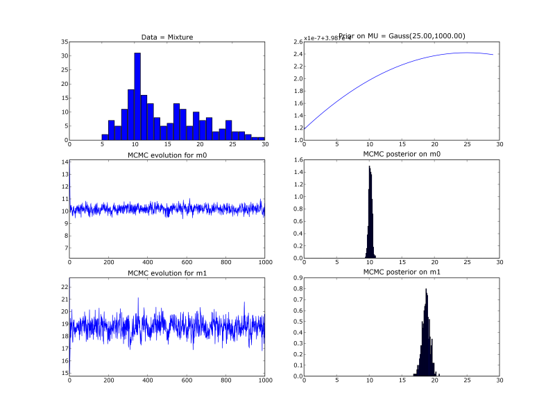

|*Original link*| http://yamlb.wordpress.com/2006/05/30/mcmc-methods-in-a-nutshell/|
|*Date*| 2006-05-30|
|*Status*| publish|

Laird Breyer presents a really nice<a target="_blank" href="http://www.lbreyer.com/classic.html"> Java applet</a> of Makov Chain Monte Carlo (MCMC) methods in action, with a short explanation of different proposal algorithms.

He's also the author of a <a href="http://dbacl.sf.net">command line bayesian text classifier (dbacl)</a> , tunable for chess "playing" !!!
# Comments

---
- author: **Pierre**
- date: 2006-06-16 16:50:35

I'm sorry but the address of this stuff changed, and I can't find it anymore on the web. Does someone knows an alternative address? (it was a really pedagogical applet). Does somebody has the email of the author?

---
- author: **Ronan**
- date: 2006-07-10 11:04:50

Cool, it's back.