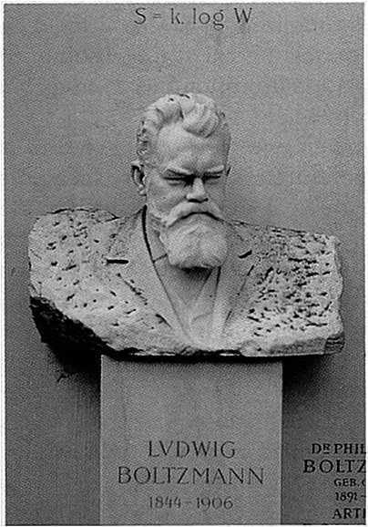

|*Original link*| http://yamlb.wordpress.com/2007/02/23/some-quotes-about-entropy/|
|*Date*| 2007-02-23|
|*Status*| publish|

"Nothing in life is certain except <strong>death</strong>, <strong>taxes </strong>and the <strong>second law</strong> of thermodynamics. All three are processes in which useful or accessible forms of some quantity, such as energy or money, are transformed into useless, inaccessible forms of the same quantity. That is not to say that these three processes don't have fringe benefits: taxes pay for roads and schools; the second law of thermodynamics drives cars, computers and metabolism; and death, at the very least, opens up tenured faculty positions"
Seth Lloyd, writing in Nature 430, 971 (26 August 2004). 

"You should call it entropy, for two reasons. In the first place your uncertainty function has been used in statistical mechanics under that name, so it already has a name. In the second place, and more important, <strong>nobody knows what entropy really is</strong>, so in a debate you will always have the advantage."  John von Neumann, in a response to Claude Shannon 

"Every mathematician knows it is impossible to understand an elementary course in thermodynamics."
V Arnold

"Thermodynamical entropy is no more objective than infomation entropy. Both are as subjective as my opinion on that issue."
Pierre Dangauthier 

"Glib, unqualified statements to the effect that "entropy measures randomness" are in my opinion totally meaningless, and present a serious barrier to any real understanding of these problems."
Edwin T Jaynes 

"Entropy is an anthropomorphic concept."
Eugene Wigner 

It follows from this that the idea of dissipation of energy depends on the extent of our knowledge. Available energy is energy which we can direct into any desired channel. Dissipated energy is energy which we cannot lay hold of and direct at pleasure, such as the energy of the confused agitation of molecules which we call heat. Now, confusion, like the correlative term order, is not a property of material things in themselves, but only in relation to the mind which perceives them. A memorandum-book does not, provided it is neatly written, appear confused to an illiterate person, or to the owner who understands it thoroughly, but to any other person able to read it appears to be inextricably confused. Similarly the notion of dissipated energy could not occur to a being who could not turn any of the energies of nature to his own account, or to one who could trace the motion of every molecule and seize it at the right moment. It is only to a being in the intermediate stage, who can lay hold of some forms of energy while others elude his grasp, that energy appears to be passing inevitably from the available tothe dissipated state."
James Clerk Maxwell, "Diffusion", Encyclopaedia Brittanica, 1878
# Comments

---
- author: **nojhan**
- date: 2007-02-26 10:44:09

“Entropy is an anthropomorphic concept.”

I believe one can say exactly the same for the "emergence" concept. Entertaining :-)