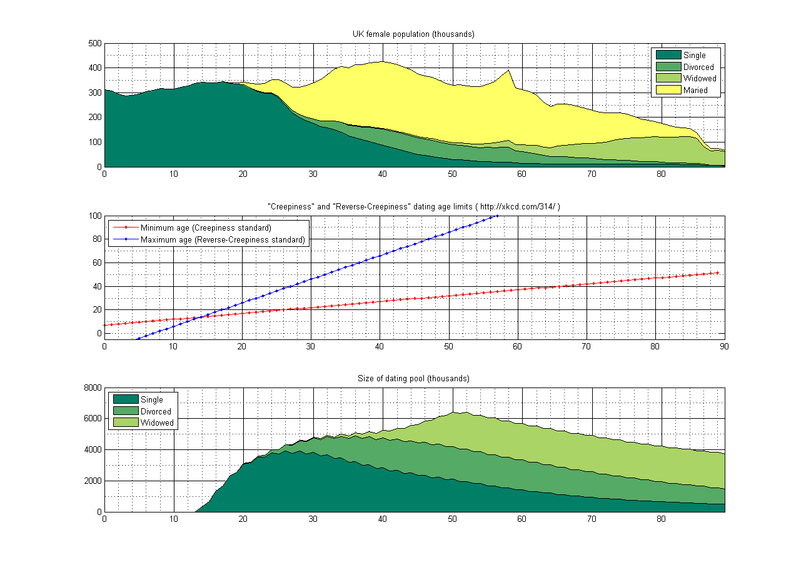

|*Date*| 2009-03-03|

Dating pool size of UK heterosexual men as function of age and the ‘creepiness standard’ rule.

Implementation of [http://xkcd.com/314/](http://xkcd.com/314/) with [UK data](http://www.statistics.gov.uk/STATBASE/ssdataset.asp?vlnk=9535).

Results maybe a bit optimistic (or pessimistic, depending on your utility function) due to the definition “single = alive unmarried non-widow”.

# Comments

> [...] xkbd, και μαθηματική τεκμηρίωση (τρόπος του λέγειν) στο Yet Another Machine Learning Blog. « Iron butterfly A slight case of overbombing [...]
Pingback by Ερωτοκυνηγός at Tijuana Del Amor — March 4, 2009

> Hehe, good one. Geeky jokes are always funny :)
Comment by Jai Pillai — July 23, 2010
