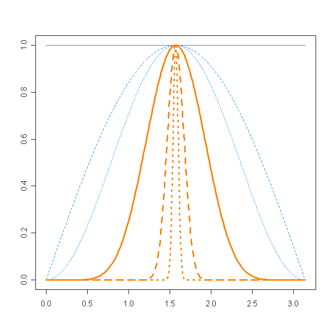
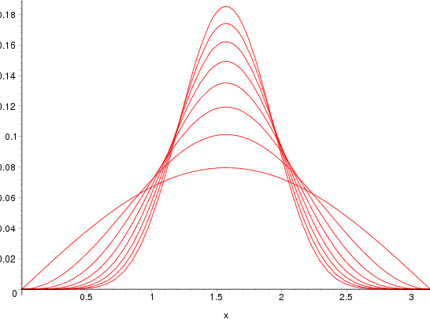

|*Date*| 2008-05-20|

[Note: correct date of this post: August 23, 2007 on 3:01 pm ]

In a recent comment, Nhat Vo wrote :

> You wrote “Indeed, in hight dimensional spaces, 2 random vectors are almost always orthogonal”. Do you have any reference or proof for that?

Here is the sketch of a proof. Consider 2 random vectors in dimension s. Let’s say that they are on the unit $(s-1)$-sphere (only directions matter), and that the first one is fixed.

Then we draw a second vector uniformly on the sphere, and we look if he is orthogonal with the fixed one. For that purpose, let’s use the $(s-1)$-dimensional spheric parametrization. A point on the sphere is parametrized with $(s-1)$ angles : $a \dots a_{s-1}$. Let’s consider that the first vector is "vertical", and that the first angle parameter is the angle between the two vectors.
The spherical parametrization says that all angles are in $\left[0,\pi\right]$, except one in $\left[0,2\pi\right]$. Moreover the uniform distribution, in this coordinate system becomes (page 67, in french) :

$$p(a_1\dots a_{s-1}) \propto \prod_{i=1}^{s-2}\,  (\sin a_i)^{s-i-1}$$

(this generalizes the 3D spherical surface element $dS = \sin \phi \, d\theta \,d\phi$)

Then we just have to calculate $p(a_1)$ as a function of $s$ to see if it concentrates around $\pi/2$, meaning that the 2 vectors are more and more orthogonal. This is easy by marginalizing other angles in $p()$ because every angles are independent. So we get :

$$p(a_1) = \int_{a_i \neq a_1} p(a_1\dots a_{s-1})\,da_i    \,\propto \,(sin a_1)^{s-2}$$

which gives the following graph. We clearly see the concentration phenomena that Terry was talking about. When s gets bigger, we obtain a narrower distribution, and the probability that $a_1$ is $\epsilon$-close to $\pi/2$ becomes larger. Image for s=2, 4, 40, 100 and 1000 :

In the limit, $s \rightarrow\infty$, all vectors are almost surely orthogonal. For instance, the scalar product of 2 random functions over $\left[0,1\right]$ is 0 (remember that such functions are almost surely not continuous).

PS: I didn’t took care of the normalizing constant, but Christophe did :

# Comments

> That’s really cool. Richard Hamming states the same result in his book, “The Art of Doing Science and Engineering: Learning to Learn.”

Comment by AF — March 7, 2008

> That’s very interesting, I’ll think about it… :] (Hamming is my hero btw)

Comment by Nicolau Werneck — March 5, 2009

> Firstly, it is worth mentioning that this holds for random vectors coming from a zero-mean distribution.
> Secondly, here’s another, to my mind, nearly obvious proof of a similar statement.
> Let P be a probability distribution with zero mean. Let X and Y be random vectors of dimension n, so that each component $X_i$ of X and $Y_j$ of Y is taken iid from P. For example, when P is uniform this would correspond to sampling from a centered hypercube.
> Now consider the cos(angle between the vectors), which is just the correlation of the vectors:
> $cor(X, Y) = \sum_i x_i y_i / |x| |y|$ =
> $\sum_i x_i y_i/n : sqrt(\sum_i x_i^2 / n) \sqrt(\sum_i y_i^2 /n)$
> It is easy to see that this is a classical consistent estimator for the correlation of random variables X and Y. But as these variables are independent the estimator will converge to 0 almost everywhere.

Comment by KT — March 24, 2009

> I would like to ask if the random vectors are not coming from a zero-mean distribution, for example,
> Let P be a probability distribution with zero mean. Let X and Y be random vectors of dimension n, so that each component $X_i$ of X and $Y_j$ of Y is the square of the value taken iid from P, so the components $X_i$ and $Y_i$ are not coming from a zero-mean distribution and they are not uniformly distributed.
> Would these 2 vectors be also orthogonal with high probability as n is large?

Comment by Kenny — May 28, 2010

> I guess not.
> Let $X = a + X’, Y = a + Y’$, where X’ and Y’ are zero mean.
> Then
> $n = cov(X,Y) = cov(a + X’, a + Y’) = |a|^2 + cov(X’, Y’) + cov(a, X’) + cov(a, Y’) = |a|^2 + cov(X’,Y’) + a \sum X’/n + a \sum Y’/n –> |a|^2 + 0 + 0 + 0 = |a|^2 \neq 0$.
> (The equation started with
> $[X, Y]/n = cov(X, Y)$ = …
> but the parser ate my angle brackets)

Comment by KT — June 1, 2010

> In http://en.wikipedia.org/wiki/Covariance, I see the equation Cov(X+a,Y+b) = Cov(X,Y). Does it imply that we don’t need the zero-mean condition?
> In fact, I would like to know the answer in this case only:
> Let P be a uniform distribution with zero mean. Let X and Y be 2 random vectors of dimension n, so that each component $X_i$ of X and $Y_j$ of Y is the square of the value taken iid from P. Would these 2 vectors be also orthogonal with high probability as n is large?

Comment by Kenny — June 9, 2010
