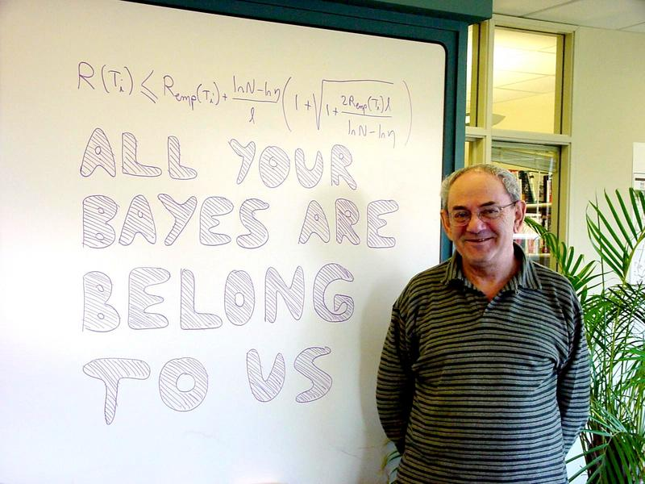

|*Original link*| http://yamlb.wordpress.com/2006/04/24/3-debates-about-machine-learning/|
|*Date*| 2006-04-24|
|*Status*| publish|

Generally speaking machine learning research aims at designing machine or agents that learns from experience, that performs better days after days. It involves the capacity of memorising information and also the capacity of generalising it in order to predict what decision to take in front of a new situation.In this scope, probabilities are often used by researchers, mainly for 2 different purposes:

<strong>1 -</strong> Analysing the performances of learning algorithms, (ex: how often it takes good decisions on a bentchmark set)

<strong>2 - </strong>Or we can use probabilities and probabilty rules as the way the agent represents its knowledge on the world ("probabilty as logic")
<ol />Those two applications are compatible, and both imply that probability is an important notion for machine learning. But the use of probability raises some debates,a t different levels. Here are 3 of them:
<ol>
	<li><strong>Vapnik or Bayes ?
</strong>Over simplifing, Vapnik learning theory aims at minimizing the probability of making bad decision in the future. But it doen't recommand a special "technology" for the algorithm itself. The most common incarnation of this theory are SVM, which tries to maximise a margin, ie to maximise a generalisation abiltity, but which rely upon hard bondaries.
On the other hand bayesian learning systems are using probabilities as the core of knowledge representation.<strong>
</strong></li>
	<li><strong>Frequencies or degree of belief </strong>?
See previous posts. Is it better to interpret probability as an agent degree of belief, or as the limit of frequency in reapeted trials ? The bayesian point of vue, involving an agent, seems to be practical for machine learning.</li>
	<li><strong>Subjective or objective bayesianism</strong> ?
This is a debate among bayesians. For them, choosing a prior is difficult problem. A lot of methods have been proposed and this is the subject of a huge litterature. But a question divides the community: <em><strong>W</strong><strong>ill two agents with the same information choose the same prior ?</strong> </em>Objective bayesians think that it's the case, that there exist a best unik prior for each problem/knowledge.
On the contrary, subjectivists are saying that the choice of a prior is a matter of convention, it's upon the agent to choose a prior in the set of priors compatible with its knowledge.
This debate espacially arise when the prior has to be "non informative". Almost everybody agree that "knowing nothing", "non informativeness" don't make any sense. Subjectivists assert that one can only provide <em>"reference",</em> <em>"defaults"</em> priors which can help, and that no one can define a <em>"best"</em> prior.</li>
</ol>
Personally, at present day, I think that those debates are relevant, that those approches are different, even if there are some links. Due to my reading, I'd prefer Bayes over Vapnik, beliefs over frequencies and subjectivity over objectivity.