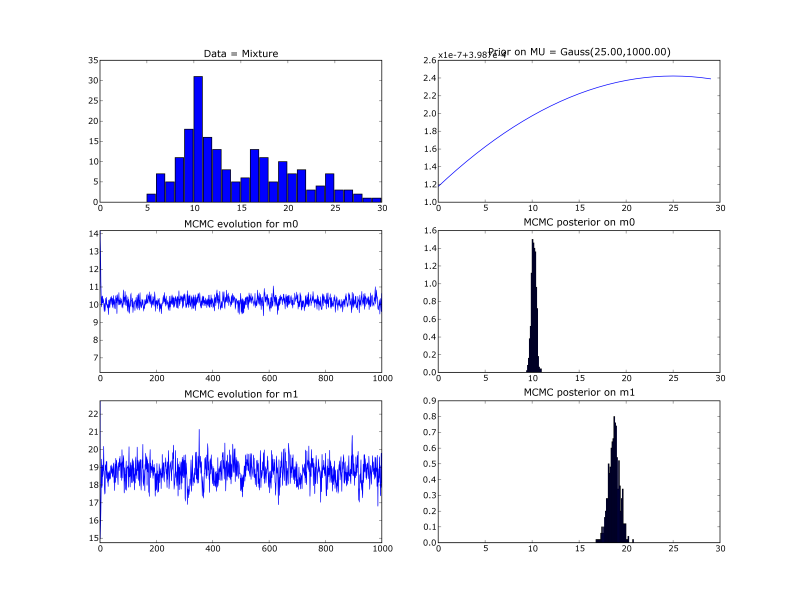

|*Original link*| http://yamlb.wordpress.com/2006/11/25/a-simple-mcmc-code-in-python/|
|*Date*| 2006-11-25|
|*Status*| publish|

- <strong>What</strong> :Implementation of a simple MCMC <a href="http://en.wikipedia.org/wiki/Gibbs_sampling">Gibbs</a> sampler.
- <strong>Goal</strong> : find the 2 means of mixture of 2 gaussians (with known variances and mixing proportion).
- <strong>How</strong> : Compute the bayesian posterior on the means, with a flat prior.
- <strong>Gibbs sampling</strong> : introduce a hidden association variable ```A[i]``` for each data ```i```. Sample iteratively on ```A```, ```mean0``` and ```mean1``` during ```k iterations```. After a 'burn in' period, ``` mean0 ``` values are distributed according to the posterior on ```mean0```.
- <strong>Results</strong> :




<strong>Details</strong>

We create an artificial data set of ```N=100``` 1D points following the mixture
```Xi ~ G(x;m0real=10, s0=2) + G(x;m1real=19, s0=5)```

We introduce the ```N``` hidden variables ```A[i]```.

We choose a flat prior:
```
mean0 ~ G(x;25, 1000)
mean1 ~ G(x;25, 1000)
```

During each iteration k, we sample
- ```A_k ~ p(A|mean0_k-1 mean1_k-1) = Bernoulli(OOO)``` (for each``` i```)
- ```mean0_k ~ p(mean0 | A_k mean1_k-1) = G(x; OOO  , OOO)```
- ```mean1_k ~ p(mean1 | A_k mean0_k-1) = G(x; OOO ,  OOO)```

Where the ```OOO``` parameters are the good one (deduced from the likelihood, I don't bother type the maths here)
All the code (with data generation, MCMC, plots and displaying statitics)

```python
#~ MCMC inference on a simple
#~    mixture of two 1D spherical gaussian
#~ Pierre Dangauthier, 2006
#~ License : GPL

from scipy.stats.distributions import *
from numpy import *
import pylab as pl

#~ Utils
def MAP(list_, domain):
    '''Arg Max of the histogram of the list, discretized by domain'''
    h = histogram(list_, domain)
    return (h[1])[argmax(h[0])]

def print_stats(list_):
    '''Print mean, map, median and variance of a list of values'''
    m = median(list_)
    v = var(list_)
    s = sqrt(v)
    print 'Mean     ', mean(list_)
    print 'Map      ', MAP(list_, arange(m-10*s, m+10*s, 20*s/1000))
    print 'Median   ', median(list_)
    print 'Variance ', v

#~ Generating artificial data
n = 100  # half of the data
N = 2*n
m0real = 10.0 # First gaussian
s0 = 2.0
m1real = 19. # Second gaussian
s1 = 5.0
data = concatenate((norm.rvs(m0real, s0, size=N/2), norm.rvs(m1real, s1, size=N/2)))

#~ Prior (really flat)
lamba_prior = 25.
sig_prior = 1000.

#~ MCMC
k = 100 # nb of mcmc iterations
m0list = [norm.rvs(lamba_prior, sig_prior)[0]]
m1list = [norm.rvs(lamba_prior, sig_prior)[0]]

for iter in range(1, k+1):
    print 'Iteration : ', iter
    # Conditional sampling of A
    #  A[i]==0 if data[i] is associated to 1st gaussian
    #  A[i]==1 if data[i] is associated to 2nd gaussian
    A = ones(N)
    for i in range(N):
        g0 = norm.pdf(data[i], m0list[iter-1], s0)
        g1 = norm.pdf(data[i], m1list[iter-1], s1)
        p = g1 / (g0 + g1)
        if g0 + g1 == 0: # avoiding 'nan'
            p = 0.5
        A[i] = bernoulli.rvs(p)[0]
    # Conditional sampling of m0
    tau = lamba_prior/(sig_prior)**2 + sum(data[A==0])/s0**2
    pi  = 1/(sig_prior)**2 + len(data[A==0])/s0**2
    m0 = norm.rvs(tau/pi, sqrt(1/pi))[0]
    # Conditional sampling of m1
    tau = lamba_prior/(sig_prior)**2 + sum(data[A==1])/s1**2
    pi  = 1/(sig_prior)**2 + len(data[A==1])/s1**2
    m1 = norm.rvs(tau/pi, sqrt(1/pi))[0]

    m0list.append(m0)
    m1list.append(m1)

# Printing stats on posteriors
print_stats(m0list[-k/2:])
print_stats(m1list[-k/2:])

#~ # Plotting posteriors
ra = [0,30]
x = arange(ra[0], ra[1], 1)

pl.subplot(321)
pl.title('Data = Mixture')
pl.hist(data, arange(ra[0], ra[1], 1))

pl.subplot(322)
pl.title('Prior on MU = Gauss(%.2f,%.2f)' % (lamba_prior, sig_prior))
pl.plot(x, norm.pdf(x, lamba_prior, sig_prior))

pl.subplot(323)
pl.title('MCMC evolution for m0')
pl.plot(m0list)
pl.ylim(median(m0list)-4, median(m0list)+4)

pl.subplot(324)
pl.title('MCMC posterior on m0')
pl.xlim(ra[0], ra[1])
pl.hist(m0list[-k/2:], arange(ra[0], ra[1], 0.1), normed=1)

pl.subplot(325)
pl.title('MCMC evolution for m1')
pl.plot(m1list)
pl.ylim(median(m1list)-4, median(m1list)+4)

pl.subplot(326)
pl.title('MCMC posterior on m1')
pl.xlim(0, 40)
pl.hist(m1list[-k/2:], arange(ra[0], ra[1], 0.1), normed=1)

pl.show()
```
