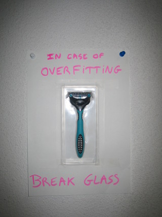

|*Original link*| http://yamlb.wordpress.com/2006/11/24/disapointed-by-your-netflix-results/|
|*Date*| 2006-11-24|
|*Status*| publish|

# Comments

---
- author: **rb**
- date: 2006-11-24 11:00:56

:)

---
- author: **Igor**
- date: 2006-11-24 20:15:56

Peut-etre que les classements humains ne sont pas Bayesiens ?

Igor.

---
- author: **Pierre**
- date: 2006-11-25 15:26:49

Maybe, but whatever the method you use for the Netflix contest, it will have to generalize to unseen cases. Thus your method could be subject to overfitting, and penalizing too complicated models (Occam Razor) could improve prediction accuracy.
On the other hand a lot of current research try to show that bayesian inference is a good model for the human decision process (ex:<a title="BACS" rel="nofollow" href="http://www.bacs.ethz.ch">BACS</a>, <a target="_blank" href="http://www.koerding.com/pubs/koerdingNature2004.pdf">Nature letter</a>).

---
- author: **Igor**
- date: 2006-11-25 18:00:44

Pierre,

I perfectly understand your point, however one of the item that bothers me is that one has to explain to the average person why it is to their advantage to choose the other door in the three door problem ? if you have to give an explanation that is, the average person, counterintuitive, then, maybe, the human decision process does not map directly to a bayesian one.

Enfin c'est ce que j'en pense.

Igor.

---
- author: **Pierre**
- date: 2006-11-25 18:50:51

Sure, humans are sometimes taking wrong decisions! The kind of research I mentioned are more focussed on low-level behavior, like low-level vision, motor control... Regarding high-level problems like logical puzzles, mathematics etc, it's much more difficult to model the decision making process ;-).
Coming back to the Netflix pb, simple model could however be stated , for instance "I usually love action movies". Such kind patterns can be found by a statistical analysis of the data set, and, why not, a bayesian anlysis.
Movie taste can be predicted in this case, as it's shown by contest leaders results.
ps: merci pour les commentaires et pardon si je n ai pas bien compris vos propos

---
- author: **Shane**
- date: 2007-01-03 05:37:33

Haha nice :)

---
- author: **Igor Carron**
- date: 2007-02-15 20:27:19

You want an inference problem that is important, try this one:
- There is this boat that we think is following currents (no sail, no engine). You have a model for these currents.

- Several satellites, planes have flown over the area and you have gotten hits, that they have seen something but we do not know if this is what we are looking for. It could be another boat going from one place to the other,....
In effect, you have two areas that have been covered and for which you have several hits.

Which of the hits in the first image is also the same hit on the second image. The two images overlap.

http://nuit-blanche.blogspot.com/2007/02/finding-jim-gray-approximate-data.html

Igor.

---
- author: **Igor Carron**
- date: 2007-02-17 13:37:58

I posted it here:
http://nuit-blanche.blogspot.com/2007/02/finding-jim-gray-first-tenacious.html

Igor.