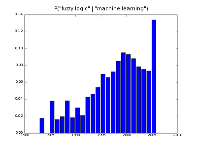
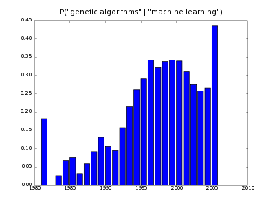
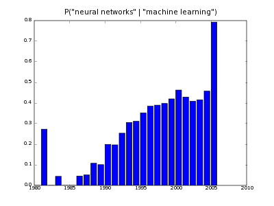
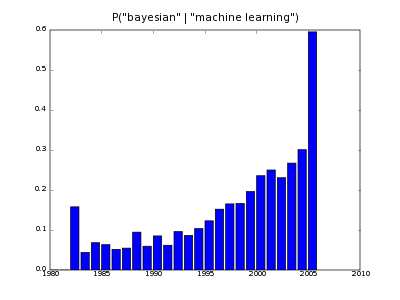
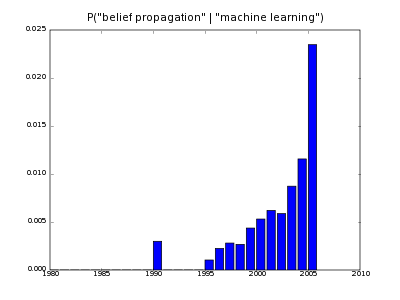
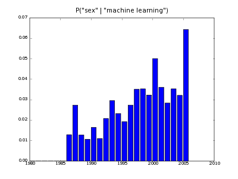
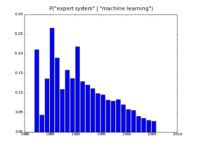
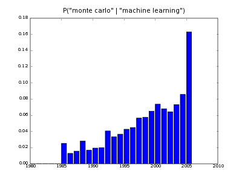
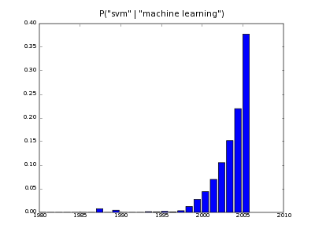

|*Original link*| http://yamlb.wordpress.com/2006/03/03/questionable-methods-awards/|
|*Date*| 2006-03-03|
|*Status*| publish|

Some A.I. methods are questionable regarding several criteria, and here is a list of methods I don't like :
<ul>
<ol> <strong>1st</strong> : Fuzzy logic</ol>
<ol> <strong>2nd</strong> : Genetic algorithms</ol>
<ol> <strong>3rd</strong> : (classical) Neural nets</ol>
</ul>

They have been chosen regarding their :
<ul>
	<li>weak mathematical foundations (GA)</li>
	<li>questionable philosophical or common sens justification (fuzzy)</li>
	<li>abscence of generality (neural nets 
	</li><li>small range of successful applications (fuzzy, genetic programming)</li>
        <li>Hard tuning (GA)</li>
</ul>

More seriously, Konstantin Tretjakov produced <a href="http://ats.cs.ut.ee/u/kt/stuff/scholartrend/">nice scripts</a> showing the number of publications on a particular suibject during time. The idea is from Yaroslav Bulatov, more informations on his <a href="http://yaroslavvb.blogspot.com/">blog</a>. I present here some results:

Please notice that these are conditional probabilities based on counting, and that year 2006 is not really relevant.
# Comments

---
- author: **Pierre**
- date: 2006-03-08 13:45:26

I edited this post because it was gratuitously polemical.

---
- author: **Will Dwinnell**
- date: 2007-02-09 11:42:15

This post seems very vague.  Can you explain, for instance, what precisely you mean when you write that genetic algorithms have "weak mathematical foundations"?

---
- author: **Pierre**
- date: 2007-02-09 14:35:08

Oh, sorry, do not feel offended, this post is actually very vague and yes, claims are not justified. A lot of brilliant people work and achieve stuff with GA. However, we have to remember that :
* GA is not magic, (when a pb is hard, it is hard)
* GA are extremely far from what happen in real evolution. A metaphor is not a proof.
* GA is just a global optimization algorithm when an oracle gives points value of the fitness landscape. There are other optimization processes.

Do we have some proofs of convergence to an (even local) optimum? Not really, there some work (schema theory) about over-simplified situations (infinite nb of individuals, no crossovers). The general case is difficult because GA performance is *highly* dependent on :
- the fitness landscape smoothness/topology
- the string representation of individuals (binary...)
- the choice of operators (mutation/crossover/selection)

Indeed there is the "No Free Lunch theorem" which basically assert that you can't expect an algorithm to work for all problems, if you don't bring some domain knowledge (roughly a "prior").

With GA this knowledge has to be put in the definition of *good* representation/operators, adapted to what you know about the shape of the fitness. And you would be surprised to see how many people try to use GA as a magical "black box".

I just want to say that one must be careful with GA. As a global optimization heuristic, they can help, but it's not enough to say that you have build an artificial intelligence algorithm.

Pierre