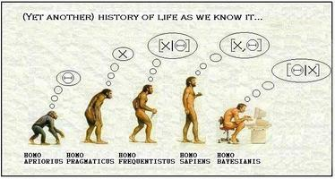

|*Original link*| http://yamlb.wordpress.com/2006/03/23/statistical-evolution/|
|*Date*| 2006-03-23|
|*Status*| publish|

I found this picture on <a href="http://quasar.as.utexas.edu/stat295.html">Bill Jeffery's' statistical course web page.</a> Jeffery strongly prefers the bayesian approach to statistics.

To explain this comic, let's quote Pr. Jefferys:
<blockquote>The basic difference between Bayesians and frequentists is this: 
Bayesians condition on the data actually observed, and consider the 
probability distribution on the hypotheses; they believe it reasonable 
to put probability distributions on hypotheses and they behave 
accordingly. Frequentists condition on a hypothesis of choice and 
consider the probability distribution on the data, whether observed or 
not; they do not think it reasonable to put probability distributions on 
hypotheses (in their opinion, one hypothesis is true, the rest are 
false, even if we do not know which is the case), and they behave 
accordingly.</blockquote>

Now the question is: What is thought by "Homo sapiens" ? I understand all others except him. Is it just to make something funny, to respect the original cartoon with five characters? Or can you assign a meaning on reasoning on the joint distribution?